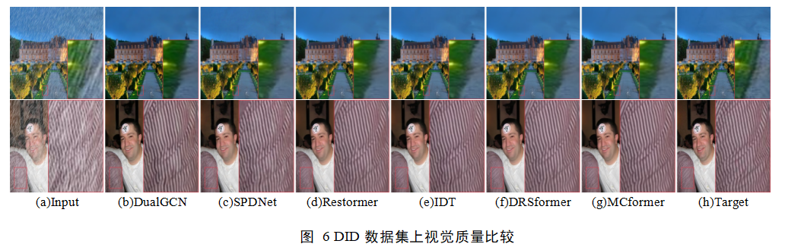
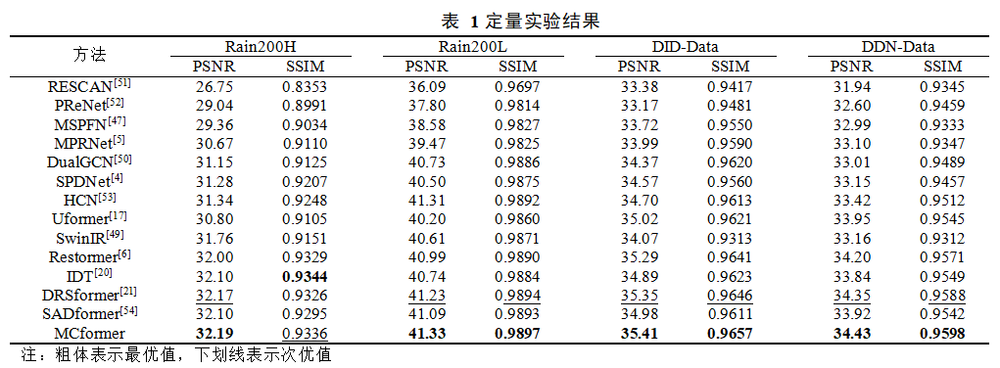

## 基于矩增强与轴向卷积融合的单图像去雨网络

### 1.视觉对比

  

### 2.定量结果

> 计算方式为使用MATLAB中YCbCr空间的Y通道中的PSNR和SSIM指标

* Rain200H/L数据集评价指标的MATLAB代码可在此获得[Rain200H/L](./eval/evaluate_PSNR_SSIM.m)
* DID-Data、DDN-Data数据集评价指标的MATLAB代码可在此获得[DID-Data、DDN-Data](./eval/statistic.m)

 ### 3.实验数据集获取(训练集、测试集)

| 数据集       | Rain200H                                                     | Rain200L                                                     | DID-Data                                                     | DDN-Data                                                     |
| ------------ | ------------------------------------------------------------ | ------------------------------------------------------------ | ------------------------------------------------------------ | ------------------------------------------------------------ |
| 百度网盘链接 | [Rain200H]( https://pan.baidu.com/s/1bflXtTmKQICGsUluu_kxCA?pwd=hrir  ) | [Rain200L](https://pan.baidu.com/s/1EbZXPgIqbsIxWVXQ3v3EIg?pwd=6nnt  ) | [DID-Data](https://pan.baidu.com/s/1AMOgCEBp-jTDUuy6jXsGbw?pwd=arua  ) | [DDN-Data](https://pan.baidu.com/s/1NNJxhRXY5NGgYlmBa27nnw?pwd=3fpw ) |

### 4.实验处理结果获取(测试集、MCformer处理后结果)

| 数据集       | Rain200H                                                     | Rain200L                                                     | DID-Data                                                     | DDN-Data                                                     |
| ------------ | ------------------------------------------------------------ | ------------------------------------------------------------ | ------------------------------------------------------------ | ------------------------------------------------------------ |
| 百度网盘链接 | [Rain200H]( https://pan.baidu.com/s/1a5MtD_0zEoC-T8xpnidizg?pwd=simv ) | [Rain200L](https://pan.baidu.com/s/1EqjK8CLkIo31yX54rUF_TA?pwd=u57s ) | [DID-Data](https://pan.baidu.com/s/1f2kfIE7EMDE3iWm2r3IwbA?pwd=vjm7 ) | [DDN-Data](https://pan.baidu.com/s/1F5sBa5ZMQ7s2o9FENVvoEA?pwd=bimb) |

  

### 4.实验代码及运行细节

> 此部分内容将在论文被接收后公开....