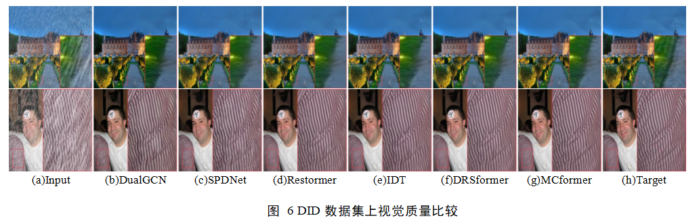
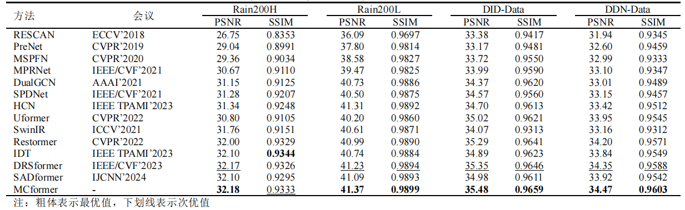

## 基于矩增强与轴向卷积融合的单图像去雨网络

### 1.视觉对比

  

### 2.定量结果

> 计算方式为使用MATLAB中YCbCr空间的Y通道中的PSNR和SSIM指标

* Rain200H/L数据集评价指标的MATLAB代码可在此获得[Rain200H/L](./eval/evaluate_PSNR_SSIM.m)
* DID-Data、DDN-Data数据集评价指标的MATLAB代码可在此获得[DID-Data、DDN-Data](./eval/statistic.m)

 ### 3.实验数据集获取(训练集)

| 数据集               | Rain200H                                                     | Rain200L                                                     | DID-Data                                                     | DDN-Data                                                     |
| -------------------- | ------------------------------------------------------------ | ------------------------------------------------------------ | ------------------------------------------------------------ | ------------------------------------------------------------ |
| 百度网盘链接(训练集) | [Rain200H]( https://pan.baidu.com/s/1Oh84iJIktJQofnCi4iwAnw?pwd=99ab ) | [Rain200L]( https://pan.baidu.com/s/1maT3mzbrUg_omOyNRj0DPg?pwd=99ab   ) | [DID-Data](https://pan.baidu.com/s/190ozQ8lB4y54bZpOnsmtQg?pwd=99ab  ) | [DDN-Data](https://pan.baidu.com/s/1wjp8KojnPaufzsL7hblQvw?pwd=99ab ) |
| 百度网盘链接(验证集) | [Rain200H](https://pan.baidu.com/s/1_L2BlD9LgIsToNZ1ZZESRA?pwd=99ab) | [Rain200L]( https://pan.baidu.com/s/1N0wDvIW27LaYRsQXNf35-w?pwd=99ab]) | [DID-Data](https://pan.baidu.com/s/16ZlbyNlzPGMjTkmA0jc4ug?pwd=99ab) | [DDN-Data](https://pan.baidu.com/s/1v5dl-l_funWlV3ZG6XvKSg?pwd=99ab) |

### 4.实验处理结果获取(测试集、MCformer处理后结果)

| 数据集               | Rain200H                                                     | Rain200L                                                     | DID-Data                                                     | DDN-Data                                                     |
| -------------------- | ------------------------------------------------------------ | ------------------------------------------------------------ | ------------------------------------------------------------ | ------------------------------------------------------------ |
| 百度网盘链接(结果集) | [Rain200H]( https://pan.baidu.com/s/1EmjMfQgjNbK2p_ry5lRE-g?pwd=99ab ) | [Rain200L](https://pan.baidu.com/s/1_x1FiTfJCN_f-rcQsMXn0A?pwd=99ab) | [DID-Data]( https://pan.baidu.com/s/1-jDzf5atqy-g3wc9ToaPjg?pwd=99ab) | [DDN-Data](https://pan.baidu.com/s/1qfz8ZInXZjtPKxZhC5uTSA?pwd=99ab) |

  

### 4.实验代码及运行细节

> 此部分内容将在论文被接收后公开....